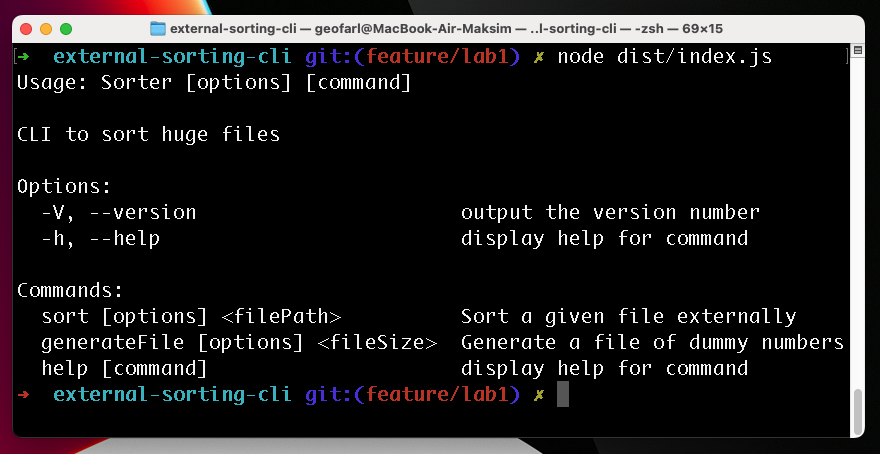
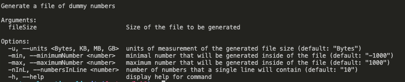
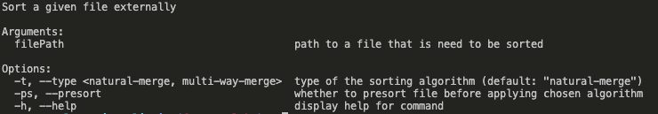

# External sorting CLI

This is a CLI that implements generating and sorting huge files of random integer numbers.
You can choose one of the two external sorting algorithms:

- Natural Merging
- Multiway Merging



## Installing

```
npm install
```

## Building

```
npm run build
```

## Running

```
node dist/index.js
```

## Testing

```
npm run test
```

## Examples

### Generating a file



```
node dist/index.js generateFile 10 -u MB -min -1000000000 -max 1000000000 -nInL 5
```

### Sorting a file



```
node dist/index.js sort -t multi-way-merge -ps ./data/generated_file_10MiB.txt
```
